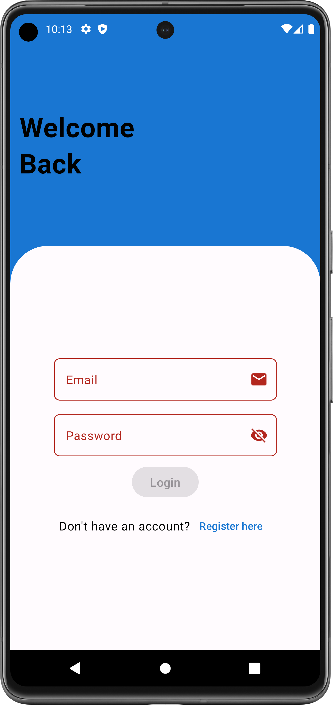
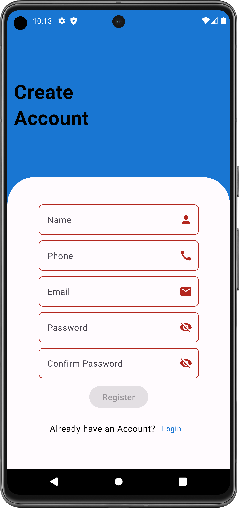
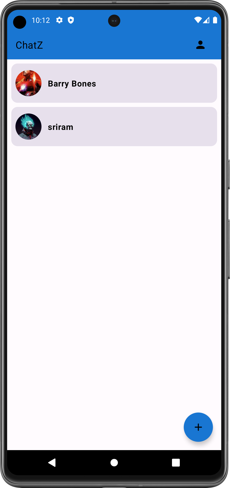
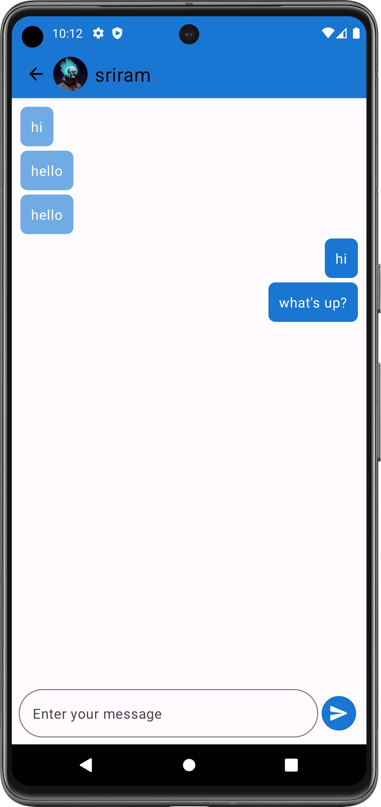
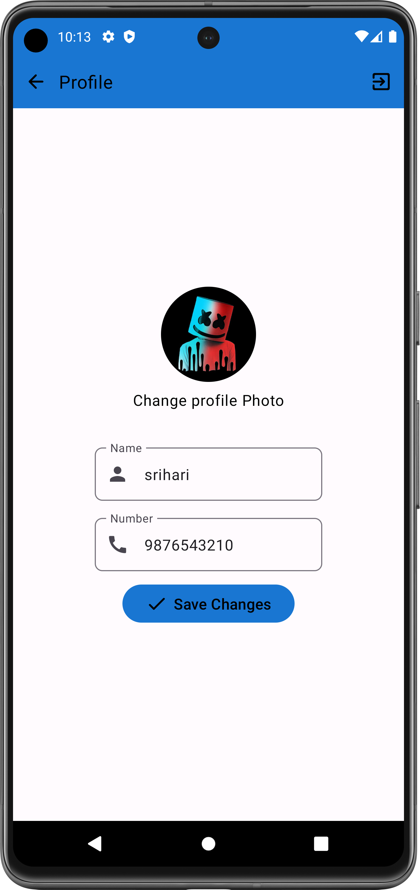
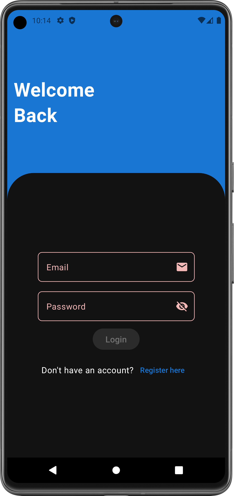
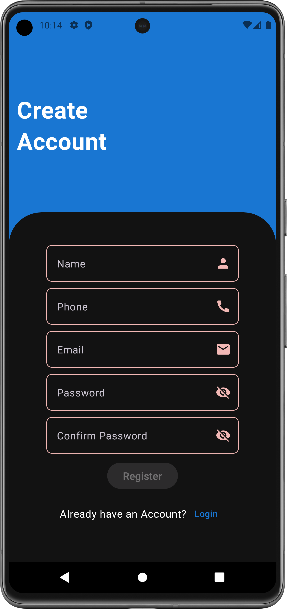
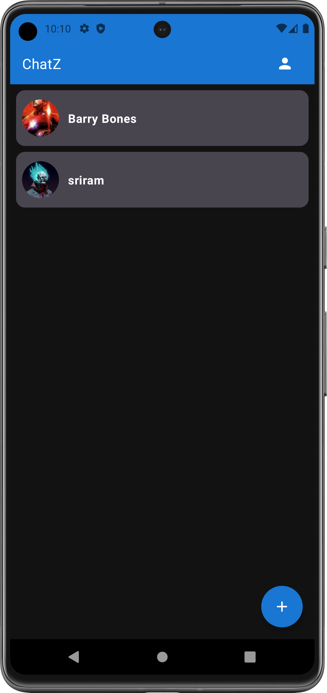
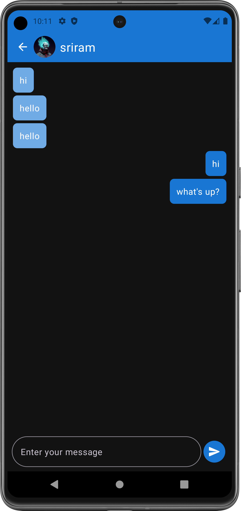
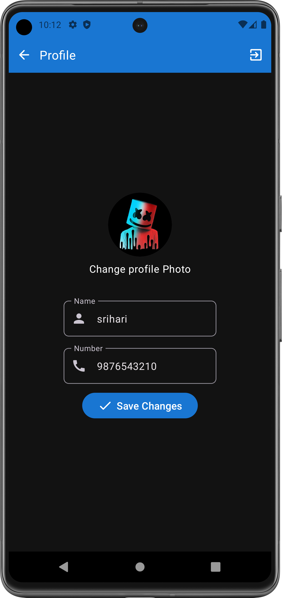

# ChatZ

ChatZ is a chat application developed using Jetpack Compose, Kotlin, and Firebase. The app allows users to send and receive messages in real-time. Users can create accounts, sign in, and start chatting with other users. Firebase is used for authentication and real-time database features, ensuring a smooth and responsive chat experience.

## Features
- User authentication using Firebase Authentication.
- Real-time messaging using Firebase Realtime Database.
- Clean and modern UI design with Jetpack Compose.
- Smooth user experience with real-time updates.

## Light Theme Screenshots

  
  
  
  
  

## Dark Theme Screenshots

  
  
  
  
  

